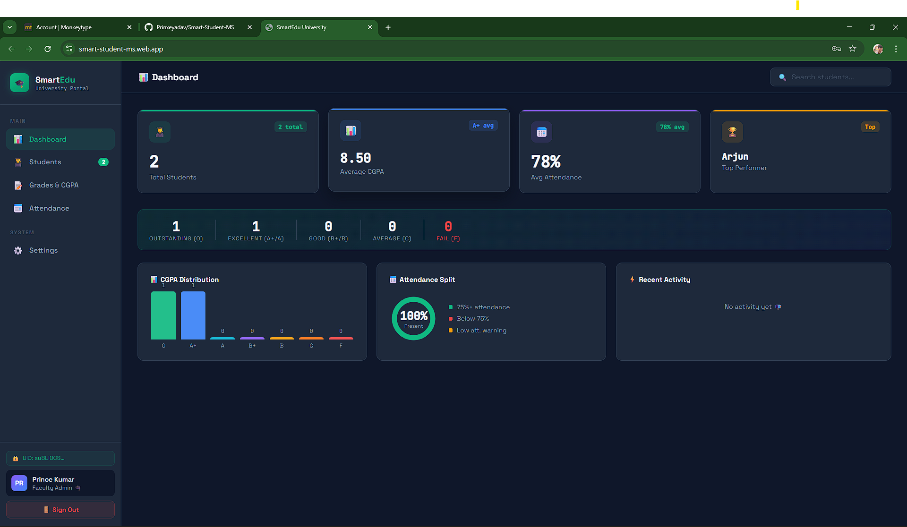
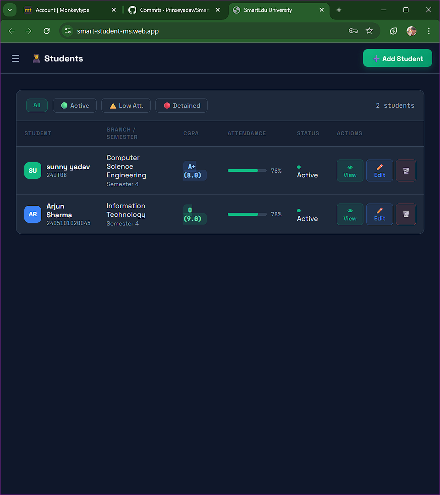
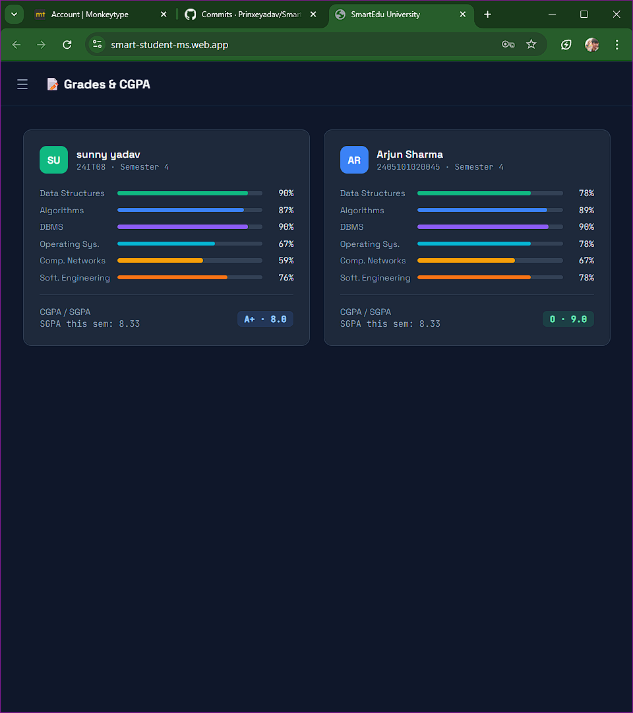
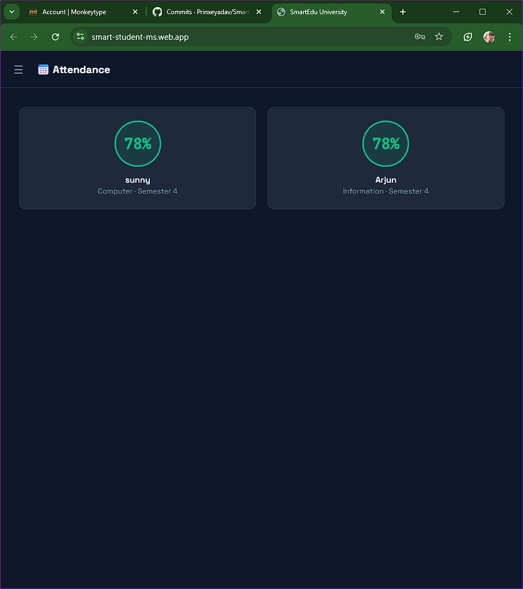
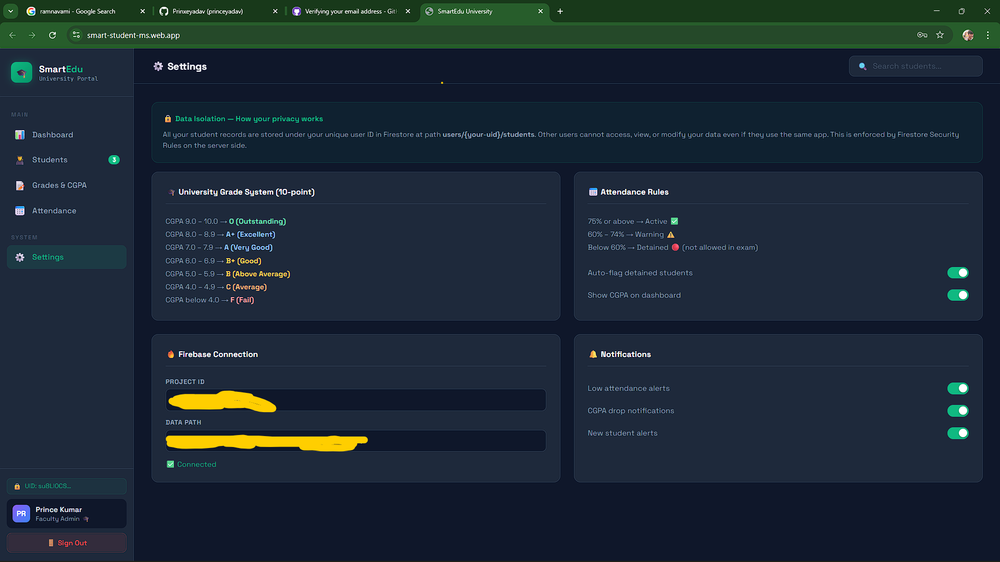
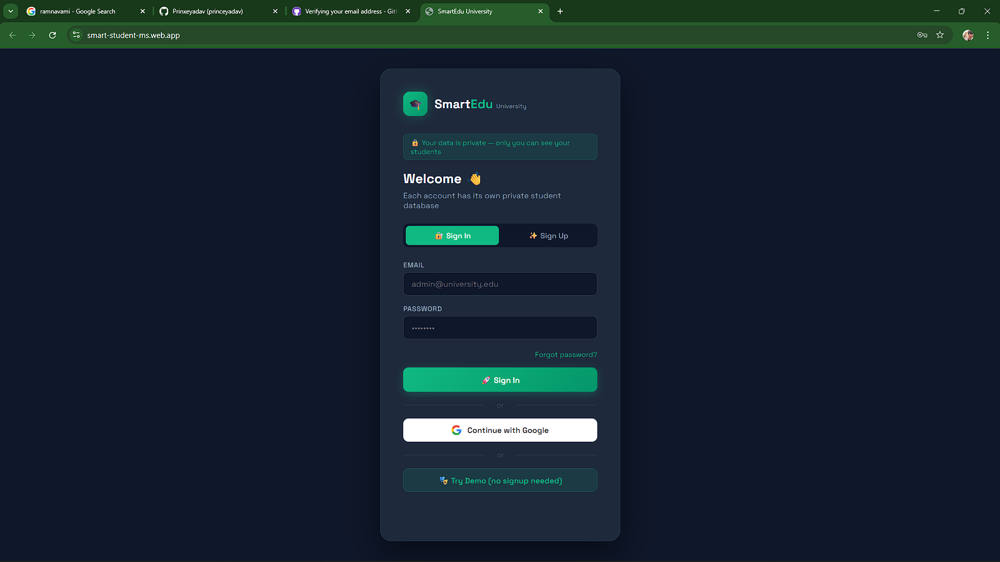
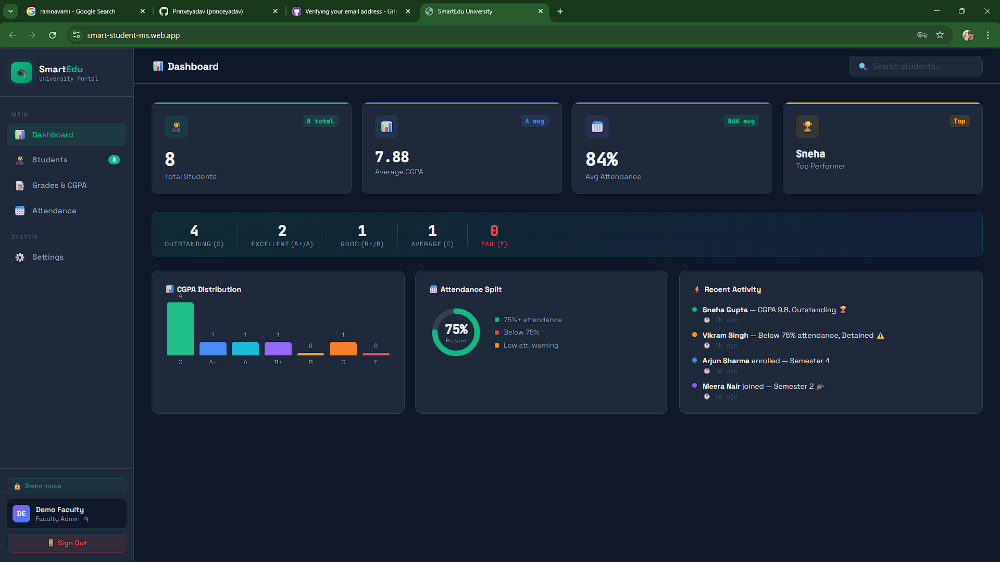
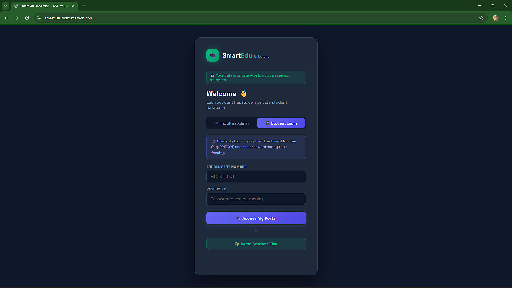

# Added the new AI model 

here is the informations what i have UPdated and how does it works;
 🤖 AI ENGINE — FREA Pattern v4.0
// Prince Kumar | Parul University | B.Tech IT (2nd Year)
//
// This engine implements 4 AI algorithms:
// 1. riskScore()      — Weighted multi-parameter dropout risk predictor
// 2. detectAnomaly()  — Attendance & grade anomaly detection
// 3. studyRecs()      — Personalised subject recommendation engine
// 4. nlpSearch()      — Natural Language Processing search
//
// All algorithms trigger automatically via Firestore onSnapshot events
// following the FREA (Firebase Real-time Event-driven Architecture) pattern.
// ══════════════════════════════════════════════════════════════════════════════

// ── 1. RISK PREDICTOR ─────────────────────────────────────────────────────────
// Weighted formula based on educational research:
//   40% weight → CGPA performance
//   35% weight → Attendance
//   25% weight → Weakest subject score
// Returns a risk score 0–100 (higher = more at risk)


# 🚀 Smart Student Management System

## 🌐 Live Demo
👉 https://your-firebase-link.web.app

## 📌 Features
- Add student records
- Calculate CGPA
- Track attendance

## 🛠 Tech Stack
- HTML, CSS, JavaScript
- Firebase

## ⚙️ How to Use
1. Open the live link above
2. Use features directly

## 📥 Run Locally
```bash
git clone https://github.com/Prinxeyadav/Smart-Student-MS.git
cd Smart-Student-MS
open index.html


Then push it:

```bash
git add .
git commit -m "Added README"
git push


<h3?> "Here are some snapshot of the  project" </h3>

## 📸 Preview










"update today --- The student section so any one can login using their Enrollment number and password given  by faculty"
